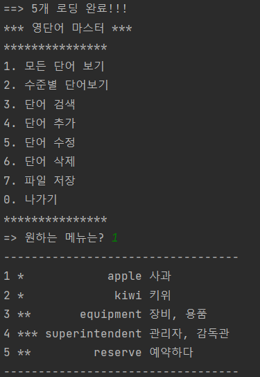

# Word Master Program (영단어 마스터)

 이 프로그램은 영단어 관리를 위한 프로그램이다.     
 저장된 단어 정보를 외부파일로부터 불러오면서 프로그램이 시작되며
1) 모든 단어 보기
2) 수준별 단어 보기
3) 단어 검색
4) 단어 추가
5) 단어 수정
6) 단어 삭제
7) 파일 저장
8) 나가기

로 총 8가지의 기능이 있다.

##### 프로그램 시작
   

##### 1) 모든 단어 보기
   

##### 2) 수준별 단어 보기
   

##### 3) 단어 검색
   

##### 4) 단어 추가
   

##### 5) 단어 수정
   

##### 6) 단어 삭제
   

##### 7) 파일 저장

##### 0) 나가기
